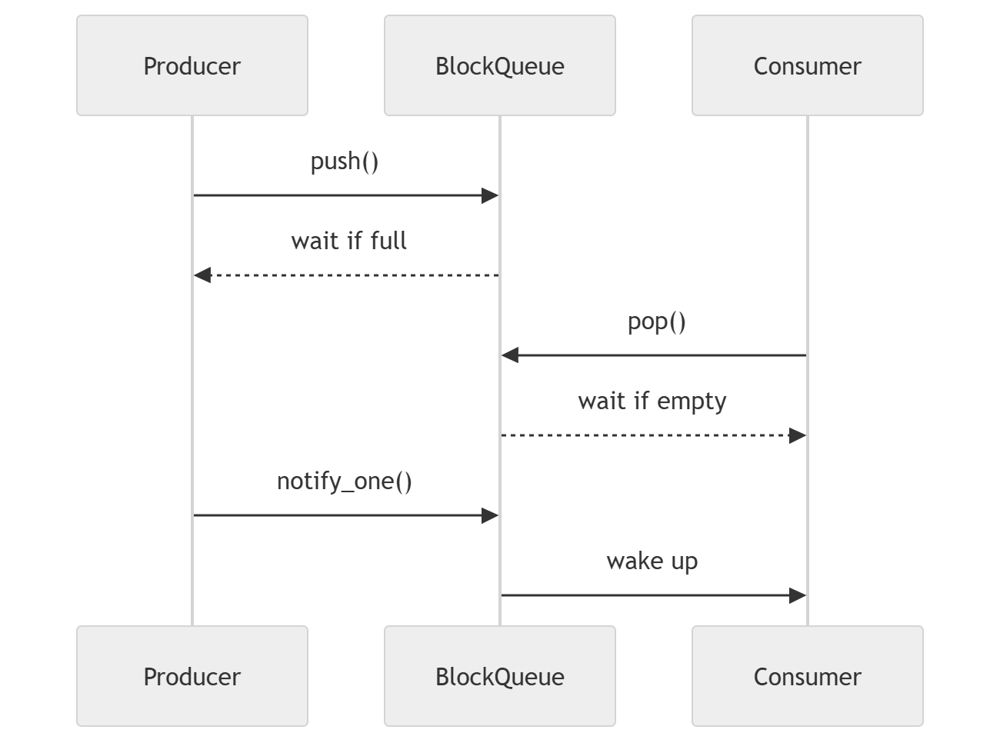

# 生产者消费者模型

## 项目简介

本项目基于C++17标准库实现经典的生产者消费者模型。
通过实现线程安全阻塞队列(Blocking Queue) 深入理解:
 
- std::thread
- std::mutex
- std::unique_lock
- std::lock_guard
- std::condition_variable
- RAII

本项目同时作为后续实现ThreadPool（线程池）的基础组件

---

## 项目结构

## BlockQueue
线程安全阻塞队列

主要功能:

- 多线程安全访问
- 队列满时阻塞生产者
- 队列空时阻塞消费者
- 支持多生产者、多消费者

---

## Producer
生产者对象
负责向队列中添加数据

---

## Consumer
消费者对象
负责从队列中消费数据

## 运行流程
